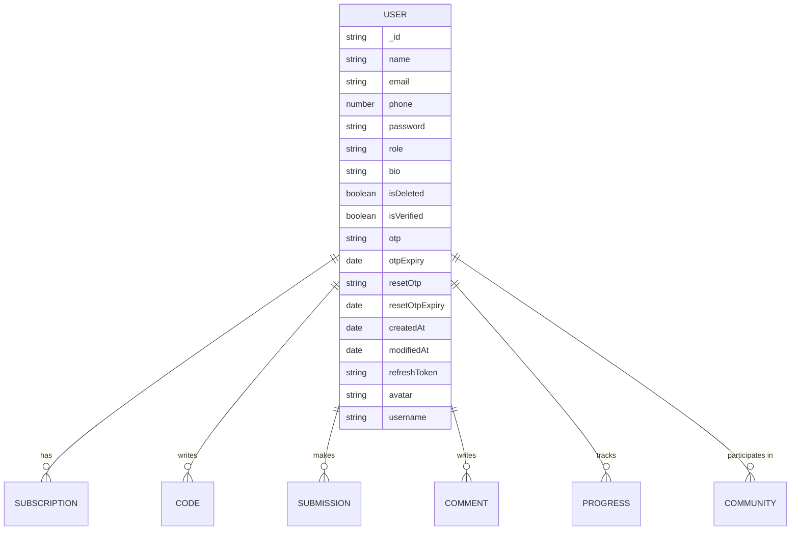
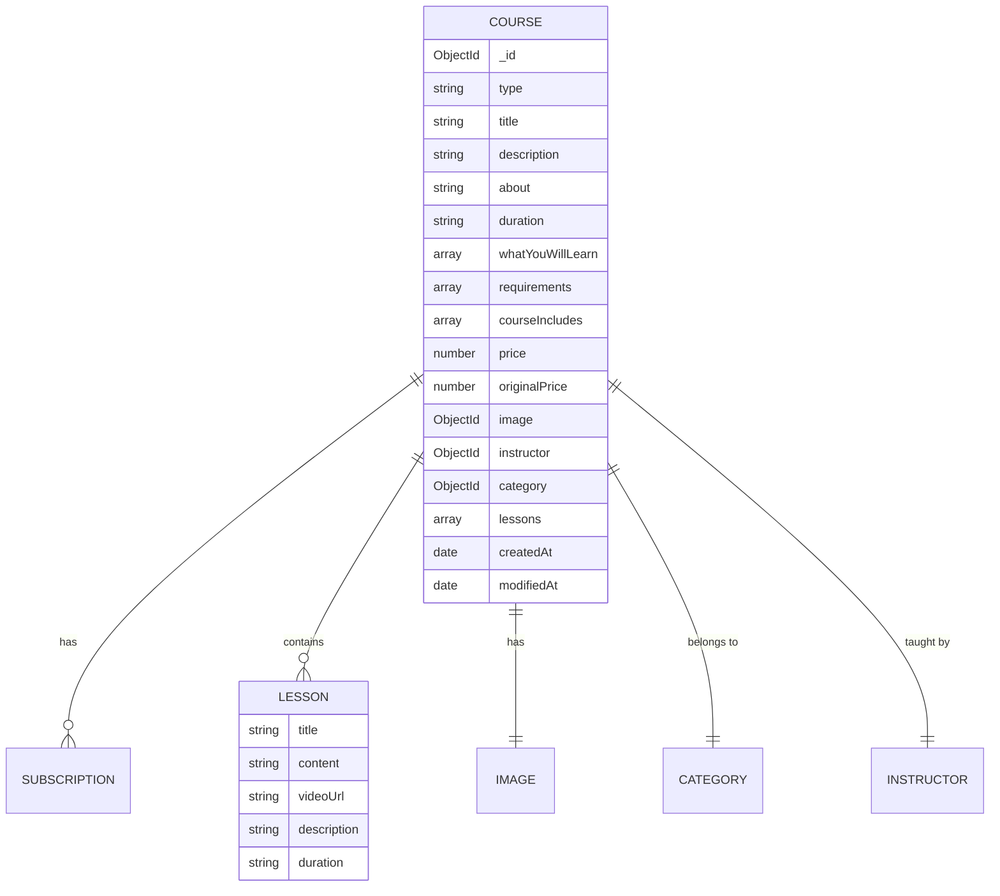
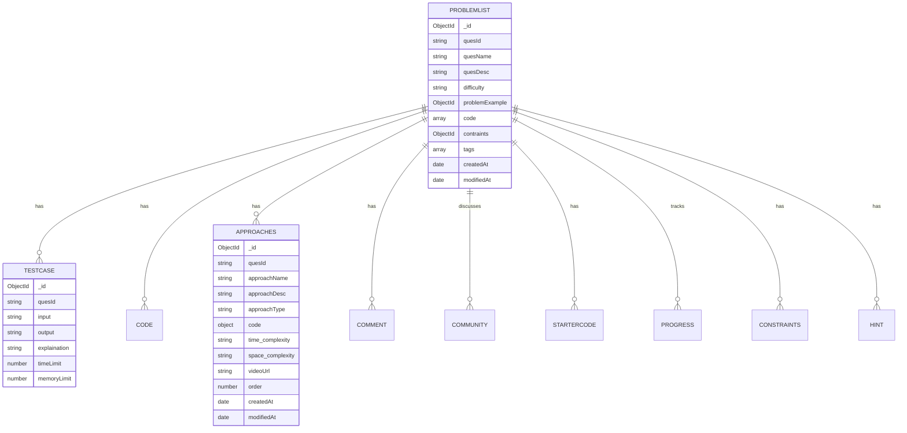
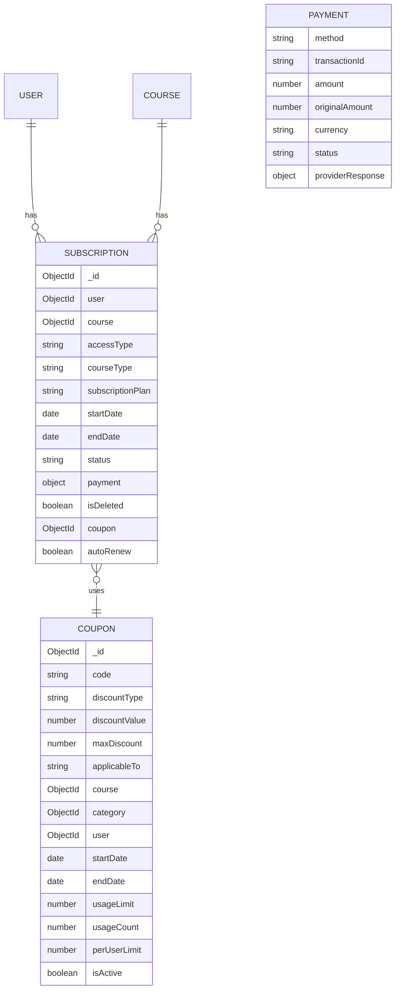
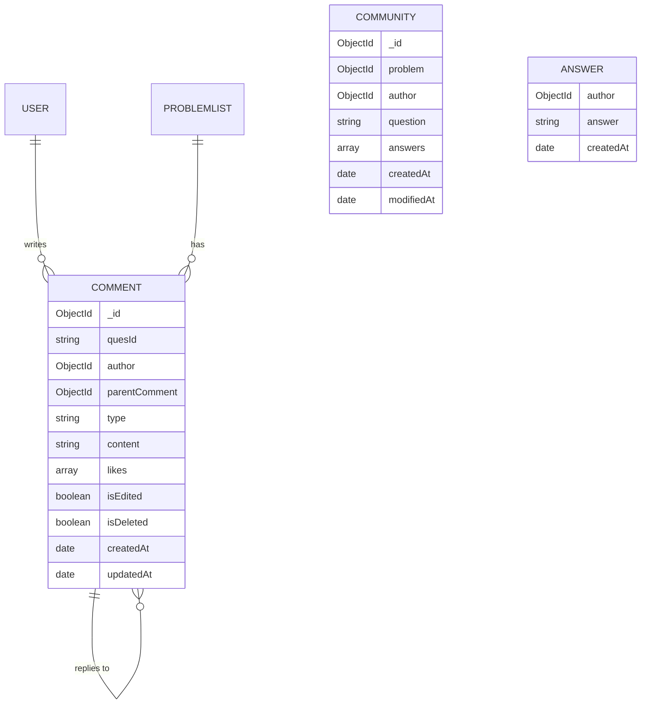

I'll create detailed ER diagrams for each collection in your MongoDB schema. Here's a comprehensive breakdown:

```mermaid
erDiagram
    USER {
        string _id
        string name
        string email
        number phone
        string password
        string role
        string bio
        boolean isDeleted
        boolean isVerified
        string otp
        date otpExpiry
        string resetOtp
        date resetOtpExpiry
        date createdAt
        date modifiedAt
        string refreshToken
        string avatar
        string username
    }

    IMAGE {
        ObjectId _id
        number imageId
        string url
        string name
        string imageType
        date uploadedAt
    }

    COURSE {
        ObjectId _id
        string type
        string title
        string description
        string about
        string duration
        array whatYouWillLearn
        array requirements
        array courseIncludes
        number price
        number originalPrice
        ObjectId image
        ObjectId instructor
        ObjectId category
        array lessons
        date createdAt
        date modifiedAt
    }
    
    INSTRUCTOR {
        ObjectId _id
        string name
        string email
        string bio
        ObjectId image
        string rating
        date createdAt
    }
    
    CATEGORY {
        ObjectId _id
        string name
    }
    
    CODE {
        ObjectId _id
        string quesId
        ObjectId userId
        string code
        string codelanguage
        date createdAt
        date modifiedAt
    }
    
    TESTCASE {
        ObjectId _id
        string quesId
        string input
        string output
        string explaination
        number timeLimit
        number memoryLimit
    }
    
    PROBLEMLIST {
        ObjectId _id
        string quesId
        string quesName
        string quesDesc
        string difficulty
        ObjectId problemExample
        array code
        ObjectId contraints
        array tags
        date createdAt
        date modifiedAt
    }
    
    CONSTRAINTS {
        ObjectId _id
        string quesId
        array contraints
    }
    
    HINT {
        ObjectId _id
        string quesId
        array hints
    }
    
    SUBMISSION {
        ObjectId _id
        string quesId
        ObjectId code
        string codelanguage
        ObjectId userId
        string status
        string execution_time
        date createdAt
        date modifiedAt
    }
    
    APPROACHES {
        ObjectId _id
        string quesId
        string approachName
        string approachDesc
        string approachType
        object code
        string time_complexity
        string space_complexity
        string videoUrl
        number order
        date createdAt
        date modifiedAt
    }
    
    PROGRESS {
        ObjectId _id
        string quesId
        string userID
        string progress
        date createdAt
        date modifiedAt
    }
    
    COMMUNITY {
        ObjectId _id
        ObjectId problem
        ObjectId author
        string question
        array answers
        date createdAt
        date modifiedAt
    }
    
    STARTERCODE {
        ObjectId _id
        string quesId
        string language
        string code
        date createdAt
        date modifiedAt
    }
    
    COMMENT {
        ObjectId _id
        string quesId
        ObjectId author
        ObjectId parentComment
        string type
        string content
        array likes
        boolean isEdited
        boolean isDeleted
        date createdAt
        date updatedAt
    }
    
    SUBSCRIPTION {
        ObjectId _id
        ObjectId user
        ObjectId course
        string accessType
        string courseType
        string subscriptionPlan
        date startDate
        date endDate
        string status
        object payment
        boolean isDeleted
        ObjectId coupon
        boolean autoRenew
    }
    
    COUPON {
        ObjectId _id
        string code
        string discountType
        number discountValue
        number maxDiscount
        string applicableTo
        ObjectId course
        ObjectId category
        ObjectId user
        date startDate
        date endDate
        number usageLimit
        number usageCount
        number perUserLimit
        boolean isActive
    }

    USER ||--o{ SUBSCRIPTION : "has"
    USER ||--o{ CODE : "writes"
    USER ||--o{ SUBMISSION : "makes"
    USER ||--o{ COMMENT : "writes"
    USER ||--o{ PROGRESS : "tracks"
    USER ||--o{ COMMUNITY : "participates in"
    
    COURSE ||--o{ SUBSCRIPTION : "has"
    COURSE ||--o{ LESSON : "contains"
    COURSE ||--|| IMAGE : "has"
    COURSE ||--|| CATEGORY : "belongs to"
    COURSE ||--|| INSTRUCTOR : "taught by"
    
    PROBLEMLIST ||--o{ TESTCASE : "has"
    PROBLEMLIST ||--o{ CODE : "has"
    PROBLEMLIST ||--o{ APPROACHES : "has"
    PROBLEMLIST ||--o{ COMMENT : "has"
    PROBLEMLIST ||--o{ COMMUNITY : "discusses"
    PROBLEMLIST ||--o{ STARTERCODE : "has"
    PROBLEMLIST ||--o{ PROGRESS : "tracks"
    PROBLEMLIST ||--o{ CONSTRAINTS : "has"
    PROBLEMLIST ||--o{ HINT : "has"
    
    SUBSCRIPTION }o--|| COUPON : "uses"
    
    IMAGE ||--o{ INSTRUCTOR : "uses"
    
    COMMENT ||--o{ COMMENT : "replies to"
```

## Detailed Collection Relationships

### User Collection Relationships

### Course Collection Relationships

### Problem Management Relationships

### Subscription and Payment Relationships

### Community and Comment Relationships

## Indexing Recommendations

Based on the schema analysis, here are the recommended indexes:

1. **User Collection**:
   - `email: 1` (unique)
   - `phone: 1` (unique)
   - `username: 1` (unique)
   - `role: 1`
   - `isVerified: 1`

2. **Course Collection**:
   - `type: 1`
   - `instructor: 1`
   - `category: 1`
   - `price: 1`
   - `createdAt: -1`

3. **ProblemList Collection**:
   - `quesId: 1` (unique)
   - `difficulty: 1`
   - `tags: 1`
   - `createdAt: -1`

4. **Subscription Collection**:
   - `user: 1, course: 1` (compound)
   - `status: 1`
   - `endDate: 1`
   - `subscriptionPlan: 1`

5. **Code Collection**:
   - `userId: 1, quesId: 1` (compound)
   - `codelanguage: 1`
   - `createdAt: -1`

6. **Comment Collection**:
   - `quesId: 1`
   - `author: 1`
   - `parentComment: 1`
   - `type: 1`

This detailed ER diagram representation shows all collections with their fields and relationships, providing a comprehensive view of your MongoDB schema structure.