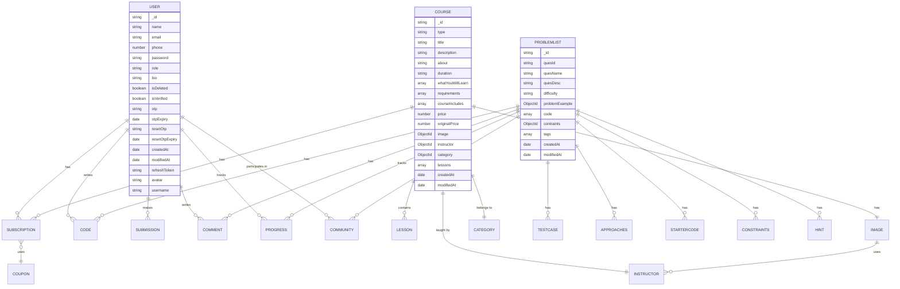
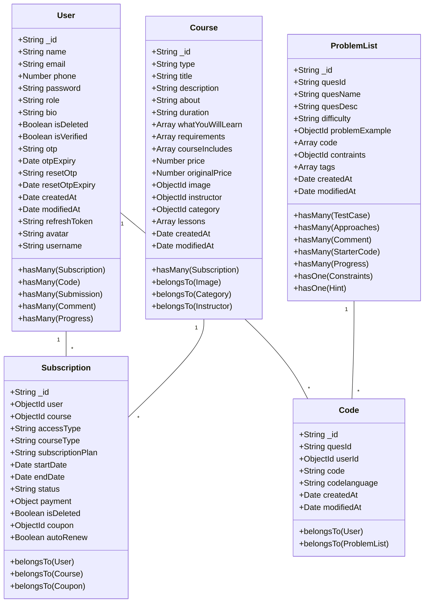
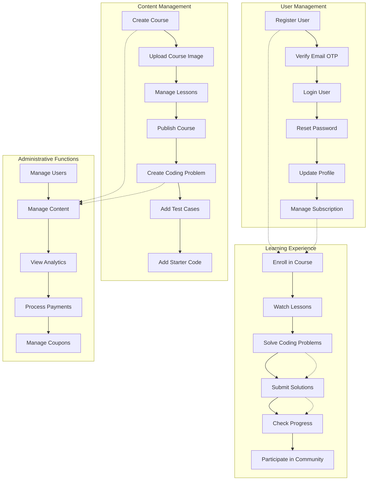
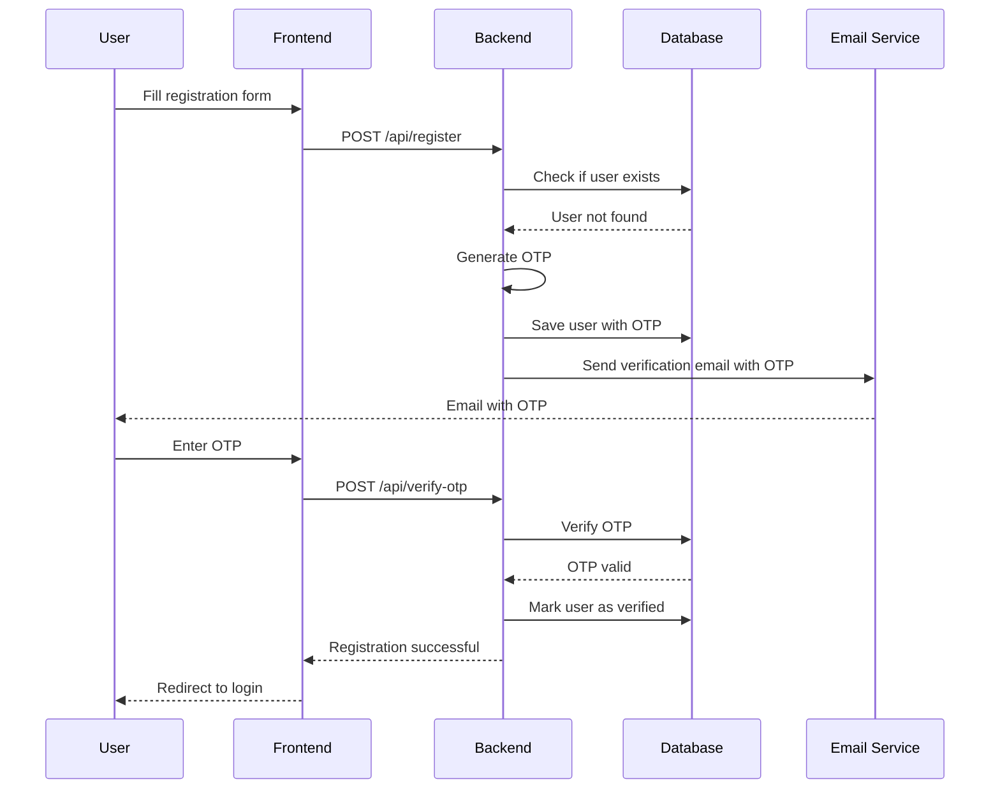
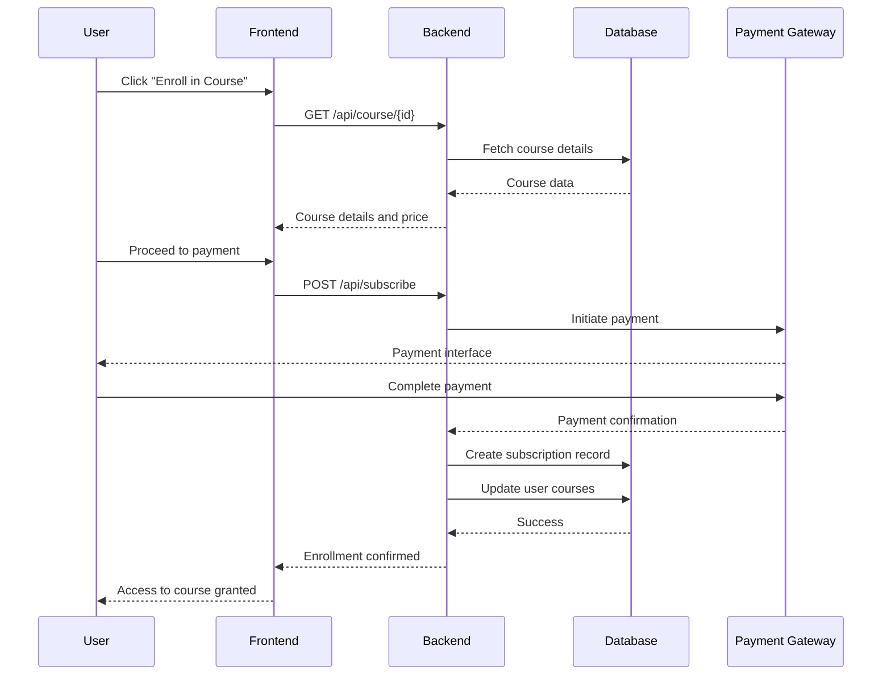
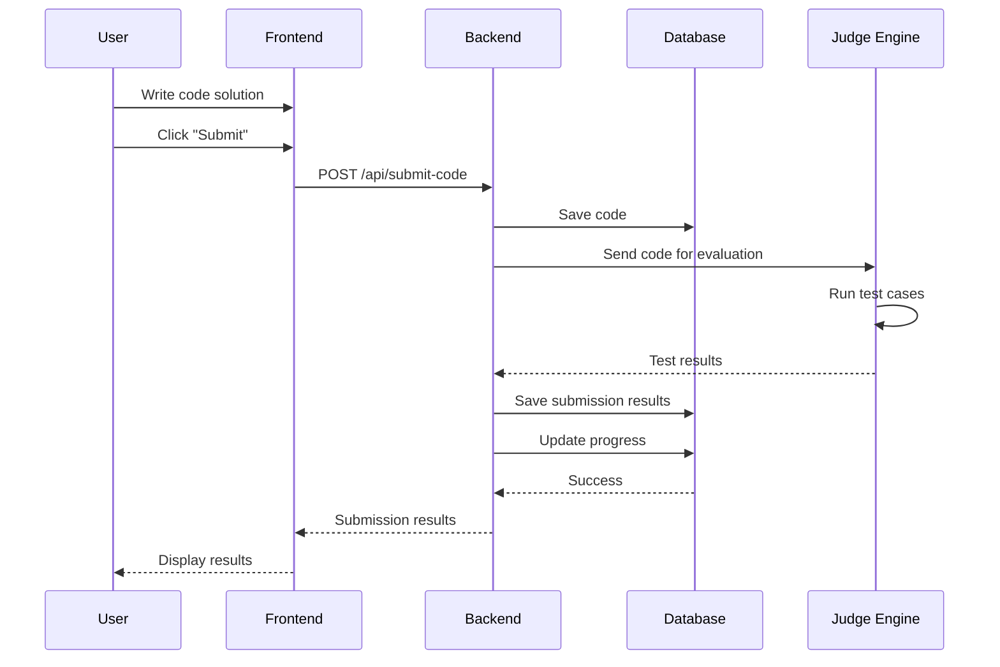

# Database Schema Documentation

## Entity Relationship Diagram (ERD)

## Class Diagram

## Use Case Diagram

## Sequence Diagrams

### User Registration Sequence

### Course Enrollment Sequence

### Code Submission Sequence

## Database Schema Details

### Collections Overview

1. **User**: Manages user accounts, authentication, and profiles
2. **Course**: Contains course and tutorial content with lessons
3. **ProblemList**: Stores coding problems with metadata
4. **Code**: User-submitted code solutions
5. **Submission**: Records of code submission attempts and results
6. **Approaches**: Different solution approaches for problems
7. **TestCase**: Test cases for validating code solutions
8. **StarterCode**: Starter code templates for different languages
9. **Subscription**: Manages user course subscriptions and payments
10. **Coupon**: Discount coupons for course purchases
11. **Community**: Discussion forum for problems
12. **Comment**: User comments on problems
13. **Progress**: Tracks user progress on problems
14. **Image**: Stores image metadata and URLs
15. **Instructor**: Course instructors information
16. **Category**: Course categories
17. **Constraints**: Problem constraints
18. **Hint**: Hints for solving problems

### Key Relationships

- **User-Course**: Through Subscription model (many-to-many)
- **User-Problem**: Through Code, Submission, Progress models (many-to-many)
- **Course-Lesson**: One-to-many embedded relationship
- **Problem-TestCase**: One-to-many relationship
- **Problem-Approach**: One-to-many relationship

### Indexing Recommendations

Based on the schema, consider adding indexes on:

1. `User.email` (unique)
2. `User.phone` (unique)
3. `User.username` (unique)
4. `Course.type` 
5. `ProblemList.difficulty`
6. `ProblemList.tags`
7. `Subscription.status`
8. `Subscription.user` + `Subscription.course` (compound)
9. `Code.userId` + `Code.quesId` (compound)
10. `Comment.quesId`

This schema supports a comprehensive learning platform with course management, coding practice, and community features.